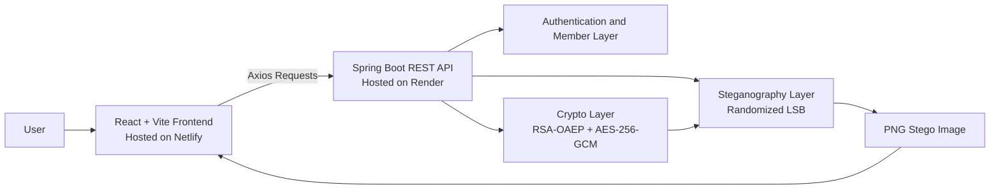

# StegaCrypt Project Report

## Acknowledgement

We sincerely thank our project guide, **[Guide Name]**, for their guidance, encouragement, and timely feedback throughout this mini project. Their suggestions helped us improve both the technical implementation and the presentation of our work.

We are also thankful to **MIT-WPU** and the Department of Engineering for providing the learning environment, academic support, and resources required to complete this project successfully.

We would also like to thank all faculty members, mentors, and reviewers who supported us during development and documentation. Finally, we appreciate the contribution of every team member for their effort in design, development, testing, deployment, and report preparation.

## Abstract / Executive Summary

StegaCrypt is a web-based application developed to hide encrypted text messages inside digital images. The main idea behind the project is simple: instead of sending sensitive data in visible form, the message is first encrypted and then hidden inside an image so that both the content and the existence of the message are protected.

The system uses a React + Vite frontend and a Spring Boot backend. For security, the application uses a hybrid encryption model in which AES-256-GCM encrypts the message and RSA-OAEP protects the AES session key. After encryption, the payload is embedded inside an image using randomized LSB steganography. The random embedding path is derived from key-related material, which makes unauthorized extraction more difficult.

In the final version of the project, we also added an authenticated secure chat module. This module supports login and registration, includes five seeded member accounts, and allows one member to send a stego image to another member inside the application itself. The extraction module was also extended so that secure chat images can be recovered by selecting the correct sender and recipient. If the wrong users are selected, the system shows an error and does not reveal the hidden message.

Overall, StegaCrypt demonstrates how cryptography and steganography can be combined in a practical full-stack application. The project is suitable for academic demonstration, secure communication experiments, and cybersecurity learning.

## 1. Project Overview

### Introduction to the Domain

Steganography is the process of hiding information inside another medium such as an image, audio file, video, or document. Unlike normal encryption, where the message is still visible but unreadable, steganography tries to hide the presence of the message itself.

In this project, steganography is used together with cryptography. This combination creates two layers of protection. First, the message is encrypted so that it cannot be read without the proper key. Second, the encrypted message is hidden inside an image so that it does not appear as obvious secret data during transmission.

### Background of the Project

Many basic steganography systems directly embed plain text in images. This approach is weak because once the hidden content is extracted, the attacker can immediately read it. Other systems use predictable embedding patterns, such as sequential pixel selection, which can make the hidden data easier to analyze.

StegaCrypt improves on these limitations by using:

- RSA public/private key based access control
- AES-256-GCM for secure message encryption
- RSA-OAEP for AES session-key protection
- Randomized LSB embedding instead of simple sequential insertion
- PNG output to preserve hidden data without lossy recompression

### Purpose and Significance

The purpose of StegaCrypt is to build a secure and easy-to-use web application for hidden communication. The project is significant because it does not treat steganography as a standalone concept. Instead, it shows how steganography becomes much more meaningful when combined with strong encryption and a usable full-stack interface.

This project is useful for academic learning, cybersecurity demonstrations, secure communication experiments, and practical understanding of layered data protection.

## 2. Problem Statement

### 2.1 Business Problem

In digital communication, users and organizations often need to exchange sensitive information. Sending confidential data as plain text is risky because it can be intercepted, copied, or exposed accidentally. Even encrypted data can draw attention because it is clearly visible as secret information.

The resulting problems include:

- Risk of confidential data leakage
- Reduced privacy during digital communication
- Limited access to practical tools for hidden secure sharing
- Difficulty demonstrating secure communication techniques in an accessible way
- Possible reputational or operational damage if private information is exposed

StegaCrypt addresses this problem by encrypting the message and then hiding it inside an ordinary-looking image before sharing.

### 2.2 Technical Problem

From a technical point of view, the challenge is to hide a message in an image while making sure that only the intended recipient can recover and read it.

Common issues in simpler systems include:

- Storing hidden data as plain text
- Dependence on shared passwords instead of public/private keys
- Predictable embedding patterns
- Loss of hidden data when lossy image formats are used
- Weak extraction control when the embedding method becomes known

StegaCrypt solves these problems by combining hybrid encryption, randomized pixel selection, backend-based processing, and recipient-specific extraction.

## 3. Scope

### Included in the Project

- RSA key pair generation
- Public-key based message embedding
- Private-key based message extraction
- AES-256-GCM encryption of message payloads
- RSA-OAEP wrapping of AES session keys
- Optional message compression before encryption
- Image upload and stego image download
- PNG stego output generation
- Image capacity checking
- React-based user interface
- Secure chat workspace with login and registration
- Five seeded member accounts for project demonstration
- In-memory secure chat history for sender-to-recipient communication
- Member-based extraction for secure chat images
- Wrong-user validation during secure-chat extraction
- Spring Boot REST API backend
- Deployment-ready configuration for Netlify and Render

### Excluded / Limitations

- No production-grade authentication features such as password reset, email verification, or session expiry management
- No database storage for users, messages, keys, or chat history
- No long-term cloud storage of stego images
- No support for lossy output formats like JPG for final stego images
- No mobile app version
- No automated steganalysis resistance scoring
- No multi-recipient encryption in a single stego image
- No enterprise audit logging

## 4. Objectives

### Primary Objective

To develop a secure web-based steganography application that allows users to hide encrypted text messages inside images and recover them only through the correct key-based process.

### Secondary Objectives

- Build a clean and responsive frontend for user interaction
- Implement a Spring Boot backend for cryptography and image processing
- Use RSA key pairs instead of shared-password dependency
- Use AES-256-GCM for secure authenticated encryption
- Use randomized LSB embedding for less predictable data placement
- Provide image capacity checking before embedding
- Implement secure in-app sharing between registered members
- Extend extraction to support secure-chat images through sender and recipient selection
- Deploy the system using suitable frontend and backend hosting platforms

### Measurable Goals

- Generate RSA-2048 key pairs successfully
- Embed encrypted payloads into PNG images
- Extract messages only with the correct private key
- Validate sender-recipient selection for secure-chat extraction
- Provide API health check through `/api/health`
- Build the frontend successfully using `npm run build`
- Package the backend successfully using Maven and Docker-ready configuration

## 5. System Architecture and Tools Used

### 5.1 System Architecture

### Components Explanation

- Frontend: Handles user interaction for key generation, embedding, extraction, login, registration, and secure chat.
- Backend: Provides REST API endpoints for encryption, extraction, authentication, secure chat operations, and capacity checks.
- Authentication Layer: Manages seeded users, registered users, and secure-chat access flow.
- Cryptography Module: Encrypts and decrypts payloads using RSA and AES.
- Steganography Module: Hides encrypted payloads in randomized LSB positions inside the image.
- Image Processing Module: Loads images, validates them, and exports PNG output.
- Database: Not used in the current version; all chat data remains in memory for the running backend session.
- Hosting Layer: Netlify serves the frontend and Render hosts the backend API.

### 5.2 Tools and Technologies

| Category | Tools/Technologies |
| --- | --- |
| Programming | Java 17, JavaScript, JSX, HTML, CSS |
| Frontend | React 18, Vite, Axios, Lucide React |
| Backend | Spring Boot 3.2, Maven, Spring Web, Spring Validation |
| Database | Not used in current version |
| Platform | Netlify, Render |
| Security Tools | RSA-2048, RSA-OAEP with SHA-256, AES-256-GCM |
| Image Processing | Java BufferedImage, PNG output, LSB steganography |
| Others | Docker, Git, environment-based deployment configuration |

## 6. Project Work Distribution

| Team Member | Role | Responsibility |
| --- | --- | --- |
| Abhishek Sushant Chaskar | Frontend and Integration | Worked on the React interface, secure chat flow, extraction updates, and frontend-backend API integration. |
| Aditya Atul Deshpande | Backend and Security | Worked on Spring Boot APIs, secure chat services, authentication logic, backend integration, and the encryption and steganography flow. |
| Tanvi Dongare | Documentation, Testing, and Deployment | Worked on testing, project documentation, deployment setup, environment handling, and preparation of the project report. |

## 7. Explanation of Project Modules

### Module 1: Frontend User Interface

Description:  
The frontend is built using React and Vite and provides the complete user-facing workflow.

Functionality:

- Accepts image uploads
- Accepts secret message input
- Generates RSA keys
- Supports normal embed and extract flows
- Supports secure chat with login and registration
- Supports extraction using secure-chat member selection
- Displays success, validation, and error messages
- Allows download of stego PNG images

Inputs:

- Image file
- Secret message
- Public key or private key
- Secure chat user selections
- Compression choice

Outputs:

- RSA keys
- Downloadable stego image
- Extracted plaintext
- Validation and status messages

### Module 2: API Communication Module

Description:  
This module connects the frontend to the backend using Axios-based HTTP calls.

Functionality:

- Calls `/generate-keys`, `/embed`, `/extract`, `/capacity`, and `/health`
- Calls authentication and secure-chat endpoints such as `/auth/login`, `/auth/register`, `/auth/chat`, `/auth/members`, and `/auth/extract-shared-image`
- Sends multipart form data for image-based operations
- Handles blob and JSON responses from the backend

Inputs:

- Form data from the frontend
- API base URL from environment settings

Outputs:

- API responses
- Downloadable image blobs
- Error messages

### Module 3: Key Generation Module

Description:  
This module generates RSA public/private key pairs.

Functionality:

- Generates RSA-2048 keys
- Converts keys into PEM format
- Returns the keys to the frontend

Inputs:

- Key generation request

Outputs:

- Public key
- Private key
- Key metadata

### Module 4: Secure Chat and Member Module

Description:  
This module supports authenticated stego sharing between members inside the application.

Functionality:

- Supports login and registration
- Loads seeded and registered members
- Assigns each user a unique RSA key pair
- Allows a logged-in sender to share a stego image with a selected recipient
- Stores secure-chat data in backend memory during runtime
- Allows only the intended recipient to decrypt secure-chat messages
- Validates sender and recipient identity when secure-chat images are extracted in the extract module

Inputs:

- Sender account
- Recipient account
- Carrier image
- Secret message

Outputs:

- Secure chat share entry
- Downloadable stego image
- Decrypted message after validation
- Wrong-keys error for incorrect sender-recipient selection

### Module 5: Encryption and Decryption Module

Description:  
This module protects the message before and after steganographic embedding.

Functionality:

- Generates a random AES session key
- Encrypts message content using AES-256-GCM
- Wraps the AES key using RSA-OAEP
- Decrypts the payload using the correct private key

Inputs:

- Plaintext or compressed message
- Public key for encryption
- Private key for decryption

Outputs:

- Encrypted payload
- Decrypted plaintext

### Module 6: Compression Module

Description:  
This module optionally compresses large messages before encryption.

Functionality:

- Decides whether compression is useful
- Compresses message bytes
- Decompresses extracted content when required

Inputs:

- Plaintext message
- Compression option

Outputs:

- Compressed data
- Decompressed message

### Module 7: Image Processing Module

Description:  
This module handles image loading, validation, and output conversion.

Functionality:

- Loads input images
- Validates image size and dimensions
- Converts output to PNG
- Provides image capacity details

Inputs:

- Uploaded image files

Outputs:

- Processed image data
- PNG output bytes
- Image metadata

### Module 8: Steganography Module

Description:  
This module hides encrypted data inside image pixels and later extracts it.

Functionality:

- Stores payload length in a header region
- Converts bytes to bits and bits back to bytes
- Uses randomized pixel positions
- Writes data into the least significant bit of the blue channel
- Extracts the same bit sequence during recovery

Inputs:

- Carrier image
- Encrypted payload
- Key-derived seed material

Outputs:

- Stego image
- Extracted encrypted payload

### Module 9: Deployment Module

Description:  
This module contains deployment-related configuration for hosting the project.

Functionality:

- Uses `netlify.toml` for frontend deployment
- Uses `render.yaml` for backend deployment
- Supports Docker-based backend packaging
- Uses environment variables for API communication and CORS settings

Inputs:

- Project source code
- Build commands
- Environment configuration

Outputs:

- Deployable frontend and backend setup

## 8. Business Use Cases

### Use Case 1: Secure Confidential Sharing

A user wants to send a private message without exposing the content directly. The user hides the encrypted message inside an image and sends the image instead of plain text.

Business value:

- Protects confidential data
- Reduces visibility of sensitive communication
- Improves privacy through layered security

### Use Case 2: Cybersecurity Demonstration and Learning

Students or faculty members want to understand how encryption and steganography work together in practice. The project offers a working example that can be demonstrated in a classroom, review, or project viva.

Business value:

- Supports hands-on cybersecurity learning
- Makes abstract concepts easier to understand
- Demonstrates secure design in an applied format

### Use Case 3: Team-Based Secure Communication Demo

A project team wants to demonstrate how one authenticated member can securely send a hidden message to another member inside the same application.

Business value:

- Makes the project demo more realistic
- Shows identity-based secure sharing
- Helps explain sender-recipient validation clearly

## 9. Application Use Cases

### Use Case 1: Generate RSA Key Pair

Actors:

- User
- Frontend
- Backend

Workflow:

1. The user clicks the generate-keys option.
2. The frontend sends a request to `/api/generate-keys`.
3. The backend generates an RSA-2048 key pair.
4. The keys are returned to the frontend.

Expected outcome:  
The user receives a new public key and private key pair.

### Use Case 2: Embed Message into Image

Actors:

- Sender
- Frontend
- Backend

Workflow:

1. The sender uploads a carrier image.
2. The sender enters the secret message.
3. The sender provides the recipient public key.
4. The frontend sends the request to `/api/embed`.
5. The backend encrypts and embeds the payload.
6. The backend returns a PNG stego image.

Expected outcome:  
The message is hidden inside the output PNG image.

### Use Case 3: Extract Message from Stego Image

Actors:

- Recipient
- Frontend
- Backend

Workflow:

1. The recipient uploads a stego image.
2. The recipient either uploads the matching key file or chooses the correct sender and recipient in Secure Chat Members mode.
3. The frontend sends the extraction request.
4. The backend extracts the encrypted payload.
5. The backend decrypts the payload using the correct private key.
6. For secure-chat images, the backend verifies the embedded sender and recipient metadata.
7. The frontend shows the recovered message or a wrong-keys error.

Expected outcome:  
The original plaintext is recovered only when the correct extraction path is used.

### Use Case 4: Secure Chat Share Between Members

Actors:

- Logged-in sender
- Logged-in recipient
- Frontend
- Backend

Workflow:

1. The sender logs into the application.
2. The sender chooses another member as recipient.
3. The sender uploads an image and enters a hidden message.
4. The frontend sends the secure-chat request through the authenticated session.
5. The backend encrypts the message and embeds it using the recipient-side key flow.
6. The recipient logs in and decrypts the shared image.

Expected outcome:  
The application supports sender-to-recipient secure chat through stego images.

### Use Case 5: Check Image Capacity

Actors:

- User
- Frontend
- Backend

Workflow:

1. The user uploads an image.
2. The frontend sends the image to `/api/capacity`.
3. The backend calculates the storage capacity.
4. The result is displayed to the user.

Expected outcome:  
The user can check whether the selected image is suitable for embedding.

## 10. Future Scope

Possible future improvements include:

- Adding persistent user accounts with database-backed history
- Adding cloud storage for generated stego images
- Supporting multiple recipients in one stego image
- Adding steganalysis resistance scoring
- Supporting other media types such as audio or video
- Building a mobile version of the application
- Increasing automated test coverage
- Adding stronger production security and session management
- Improving image suitability recommendations before embedding

## 11. Challenges Faced

### Technical Challenges

- Correctly combining cryptography and steganography
- Preserving hidden data reliably during embedding and extraction
- Preventing data corruption caused by lossy image formats
- Designing a secure chat workflow without storing sensitive information in a database
- Making sender-recipient validation meaningful for secure-chat extraction
- Managing frontend-backend integration for multipart image operations

### Team / Management Challenges

- Dividing work across frontend, backend, testing, deployment, and documentation
- Keeping the encryption workflow understandable for all team members
- Coordinating code, testing, and documentation changes together

### Resource Limitations

- Free hosting services may have cold-start delays
- No database was used, so secure chat history is temporary
- Larger images and payloads may require more optimization in future versions

### How Challenges Were Resolved

- Hybrid encryption was used for strong security with practical performance
- PNG output was enforced to preserve hidden bits
- Backend-driven processing reduced exposure of sensitive operations
- Secure-chat identity metadata was added so wrong sender-recipient selection can be rejected
- Clear documentation was maintained throughout the project

## 12. Outcome

The project successfully resulted in a full-stack secure steganography application with a working authenticated sharing workflow.

Results achieved:

- RSA key generation implemented
- AES-256-GCM message encryption implemented
- RSA-OAEP session-key wrapping implemented
- Randomized LSB steganography implemented
- Image capacity checking implemented
- Secure chat with login and registration implemented
- Five seeded project-member accounts added
- Sender-to-recipient stego sharing implemented
- Member-based extraction for secure-chat images implemented
- Wrong-user validation during extraction implemented
- React frontend integrated with Spring Boot backend

Performance / quality outcomes:

- Sensitive plaintext is not shown before decryption in secure chat
- PNG output preserves hidden data reliably
- Extraction depends on the correct cryptographic and identity-based flow
- The application demonstrates both standard steganography and authenticated member-based secure sharing

Screenshots:

- Add screenshot of home page
- Add screenshot of key generation flow
- Add screenshot of embed message flow
- Add screenshot of secure chat login and sharing flow
- Add screenshot of extraction flow

## 13. Conclusion

StegaCrypt presents a practical and meaningful implementation of secure hidden communication. By combining encryption and steganography, the project protects both the content of the message and the visibility of the message itself.

The project also goes beyond a basic steganography demo by adding an authenticated secure chat workflow with seeded member accounts and identity-based extraction validation. This makes the system more realistic, more useful for demonstration, and easier to explain in an academic setting.

Through this project, the team gained hands-on experience in full-stack development, REST API integration, image processing, modern cryptographic workflows, deployment, and technical documentation. The final result is a working mini project that clearly demonstrates how secure communication concepts can be implemented in a real web application.
